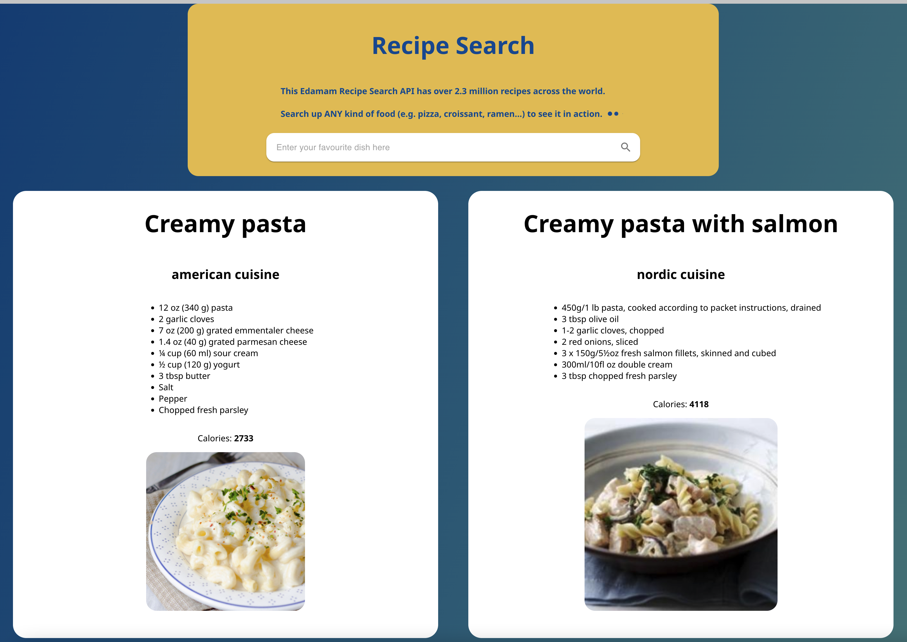
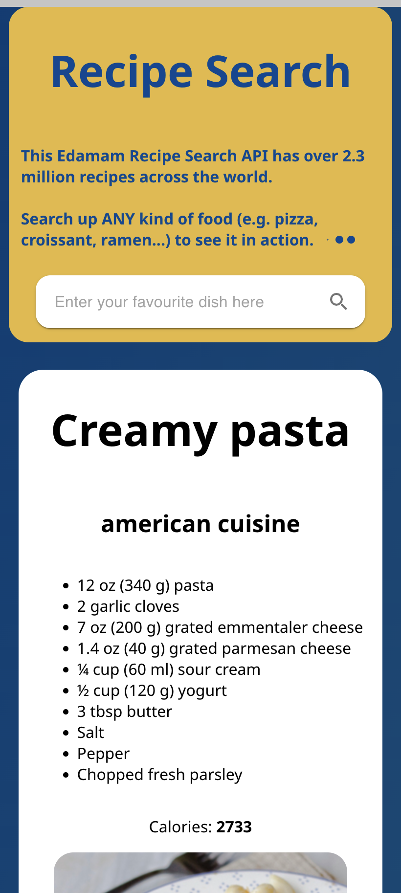

# **Recipe Search API with React.js** - [_Link here_](https://recipesearch-api.web.app)

### The goal of this project is to practice React.js and asynchronous API fetching after learning the theory.  

#### The API of this website is from edamam.com, which includes over 2.3 million recipes across the world.

 

> ### I was able to solidify my understanding with:
>
> - React.js Hooks (State/Effect)
> - Asynchronous API calls (async/await)
> - JSX (JavaScript XML)
> - React props and components
> - CSS and Material UI modules

 

### Desktop Preview:

### Mobile Preview:

### This project was bootstrapped with [Create React App](https://github.com/facebook/create-react-app).

> ### In the project directory, you can run:
>
> - #### `npm install`
> - #### `npm start`
> - #### `npm test`
> - #### `npm run build`
