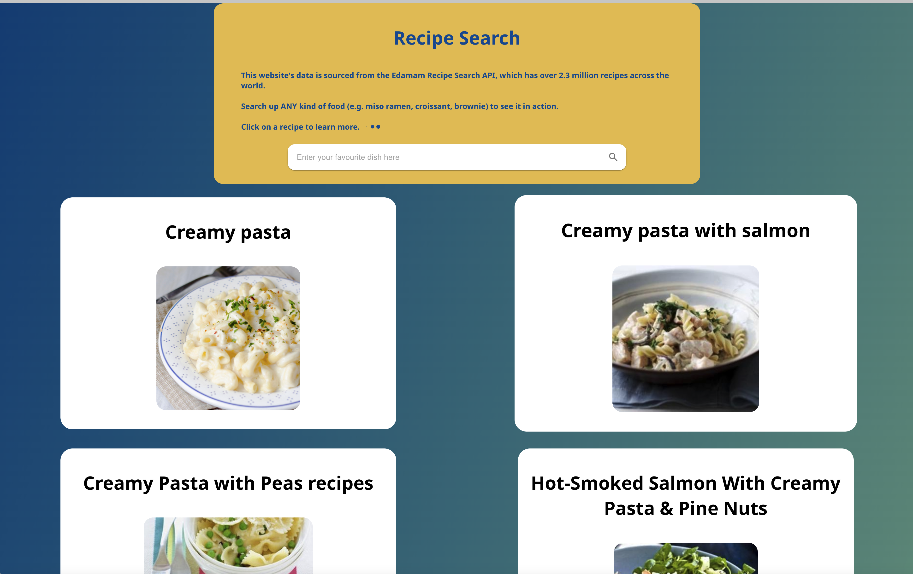
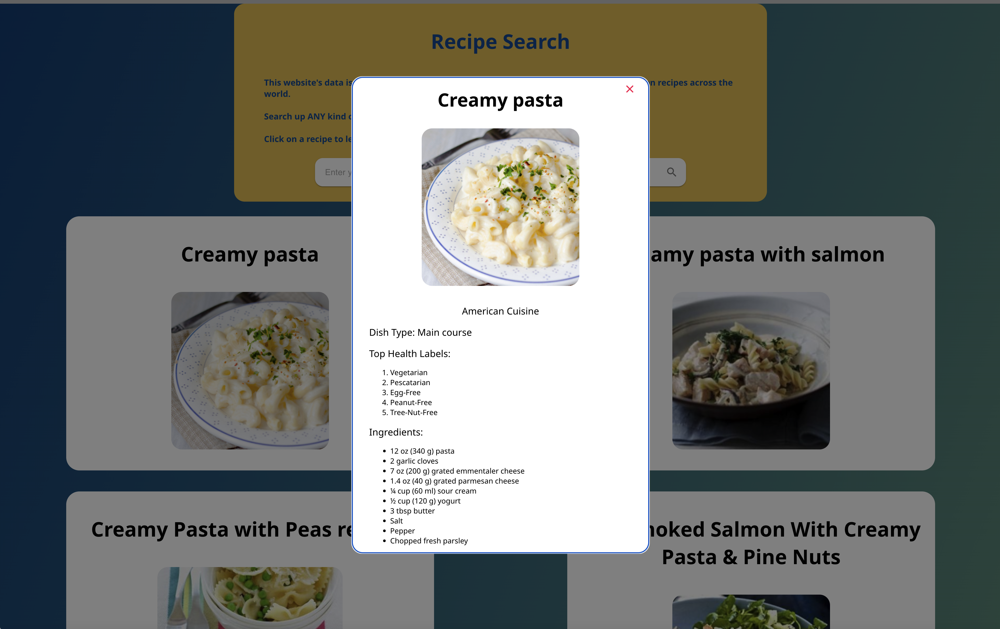
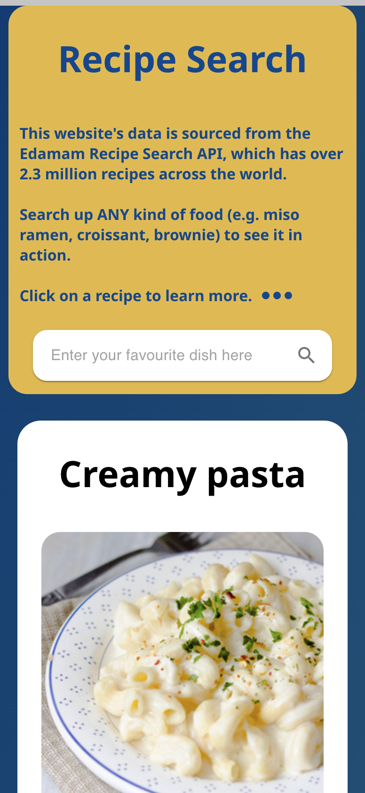

# **Recipe Search Tool** - [_Link here_](https://recipesearch-api.web.app)

### The goal of this project is to practice React.js and API requests after learning the theory about it.  

#### The data from this website is from the edamam.com API, which includes over 2.3 million recipes across the world.

> ### I was able to solidify my understanding with:
>
> - React.js Hooks (State/Effect)
> - Asynchronous API calls (async/await)
> - Processing data from API requests
> - JSX (JavaScript XML)
> - React props and components
> - CSS and Material UI components

#### After building the initial website, I consistently improved the user experience by deploying regular updates. I added new features such as the ability to click on recipes to reveal more information, a scroll to top button, an improved search-bar, and many other UI and functionality improvements.

### Update - October 2022

- Upgraded package versions (React 18, MUI 5.10, and more)
- Removed some dependencies to reduce bundle sizes
- Add continuous deployment pipeline to automatically build and deploy to Firebase
- Reworked loading UI with skeletons
- Various bug fixes and improvements

### Desktop Preview:

 

### Mobile Preview:

